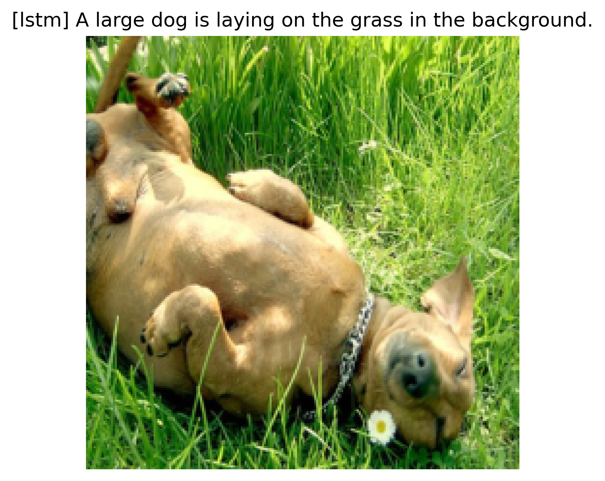
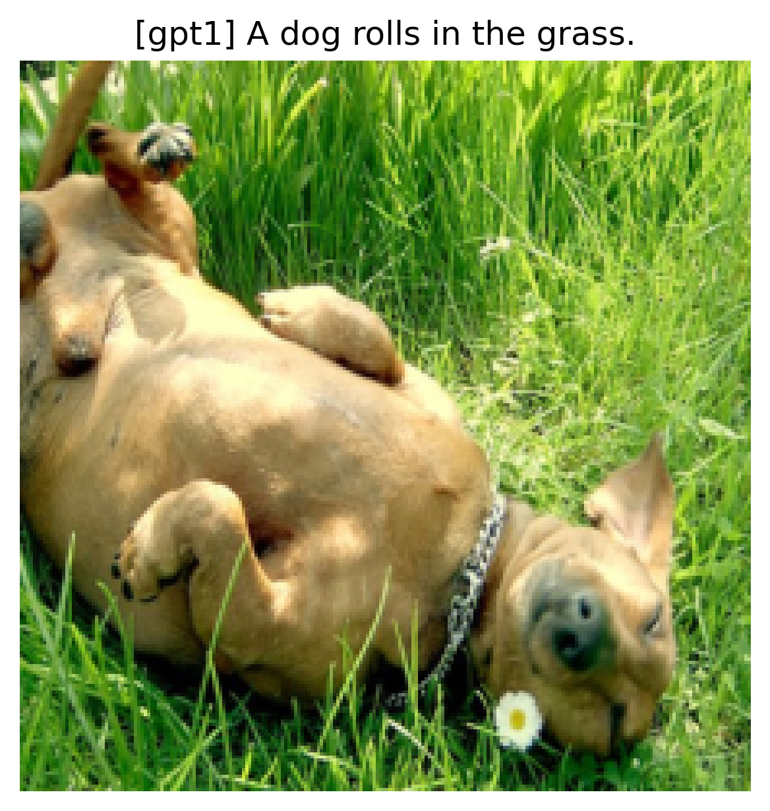
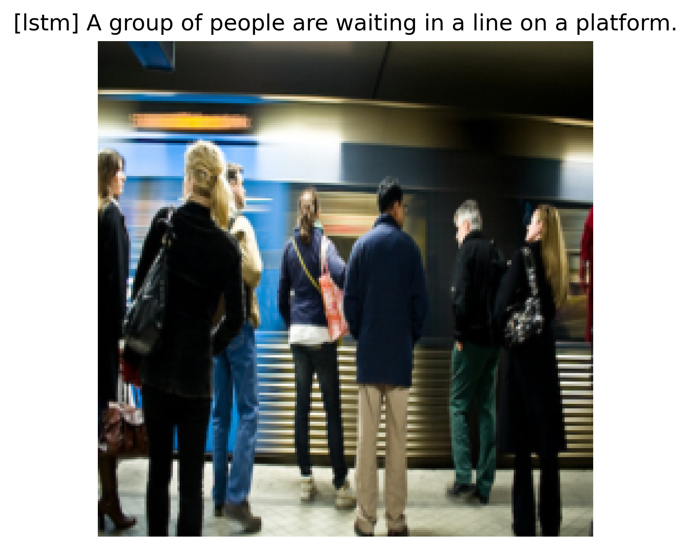
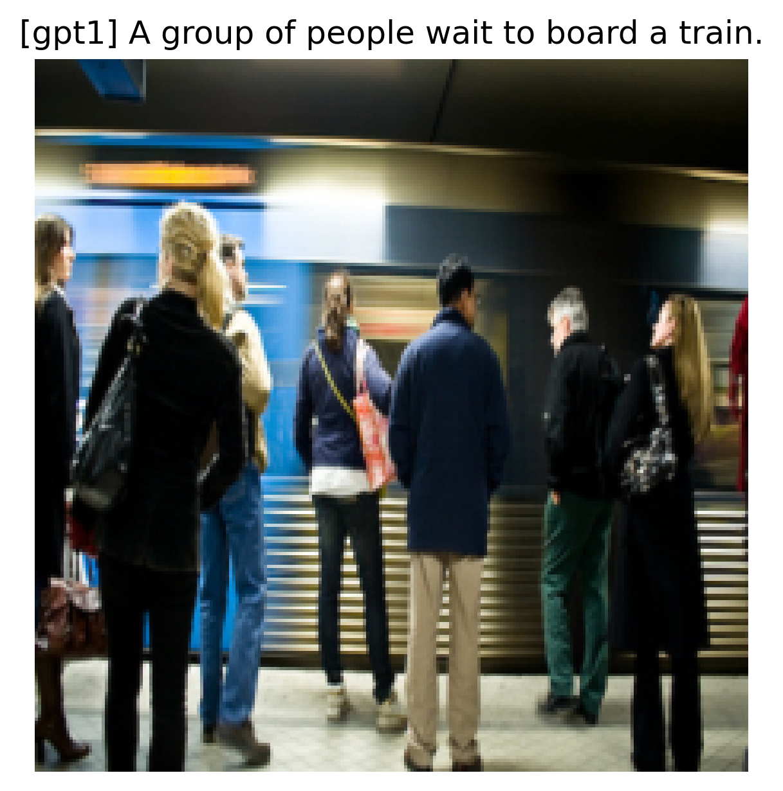

# ImageCaption

This is a toy project to get hands dirty.

Given an image as input, the model outputs a sentence to summarize the content of the image.

This project is implemented with PyTorch 2.0.1.

### Dataset

I use Flickr30k dataset from [Kaggle](https://www.kaggle.com/datasets/adityajn105/flickr30k).

### Model

I use a pre-trained ResNet-50 as the image encoder, LSTM and stacked GPT blocks as text decoders.
This work mainly falls in the text part. 

I remove the last layer of ResNet-50, then add a linear layer to map the embedding to the same size as the word embedding. 
The output of the image encoder serves as the first token for the text decoder. 

For GPT, I simply use Transformer Encoder with masks to simulate its architecture.

The models are defined in model.py.

### How to Run

Experiments are run on a Linux machine with an Nvidia Tesla V100-SXM2 GPU with 32 GB memory. 
CUDA version is 11.7 and Driver version is 515.65.01.

#### Configurations

The configurations and hyperparameters are defined in config.py.

#### Build Vocabulary

To build a vocabulary, run:

```
python vocab.py
``` 

We set four special tokens: `<pad>`, `<sos>`, `<eos>` and `<unk>`. 
The word2index file will be saved.

#### Train the Model

To train models, run:

```
python train.py --model [decoder]
``` 

You can choose 'lstm' or 'gpt1' to be the text decoder.
The trained model will be saved in ./src.

#### Test an Instance

Run:

```
python show_instance.py --model [decoder] --image_file [file]
``` 

Pick the model you want to test and the file from the image directory.

### Result

Here are some examples.
More examples can be found in ./examples.



<br />


